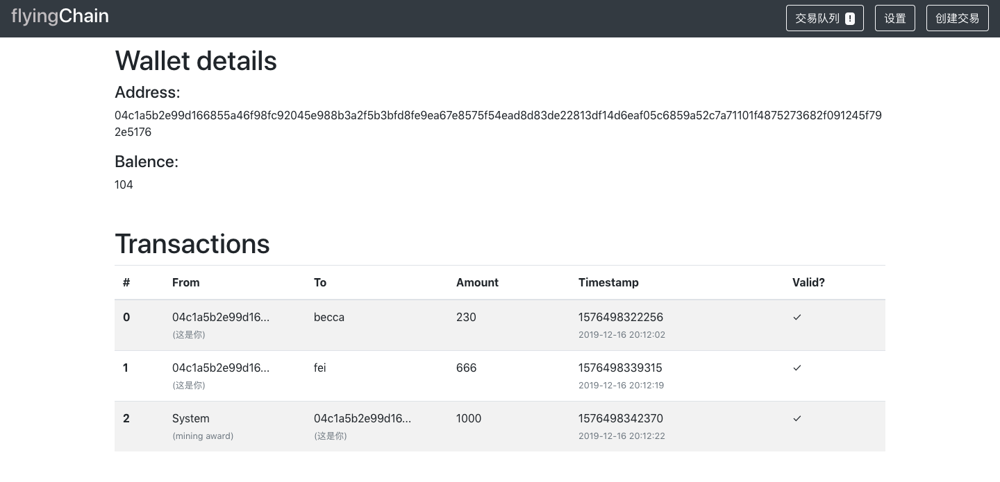

### the frontend of blockchain-demo(from 2019 seminar)
---
#### 下载项目文件
```
git clone https://github.com/sincerity628/blockchain-frontend.git
```
#### 安装依赖
```
cd blockchain-frontend
npm install
```
#### 运行项目
```
npm start
```
---
#### :eyes: 项目截图
* 首页：展示区块链上的所有区块以及对应区块所含的交易信息


* 创建交易页面：创建一个交易，放入交易等待队列中。


* 交易等待队列页面：此队列中的交易记录将会被封装至下一个区块中，在页面中可以点击按钮开始对此区块进行封装。


* 设置页面：设置封装区块的难易程度与封装区块的奖赏。


* 账户信息页面：从交易队列或者首页中的区块内信息中点击相关的交易地址即可展示相关账户的收益以及与此账户的所有相关交易。


